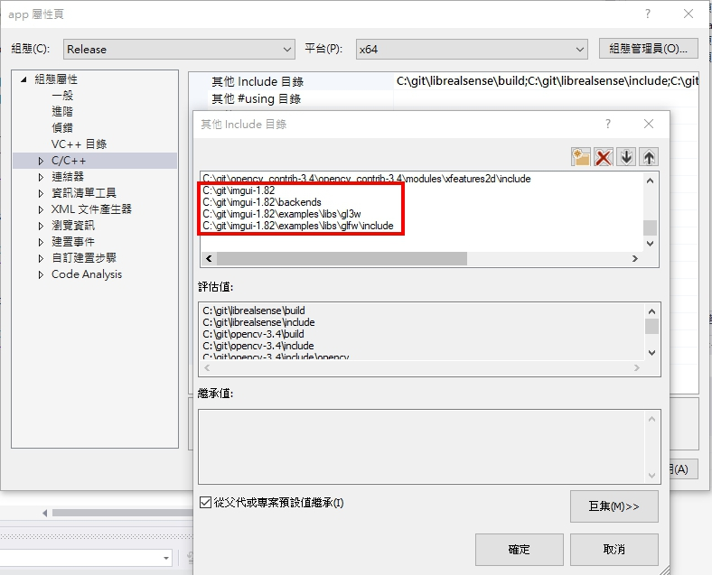
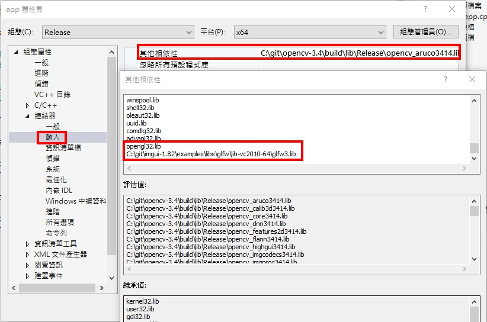
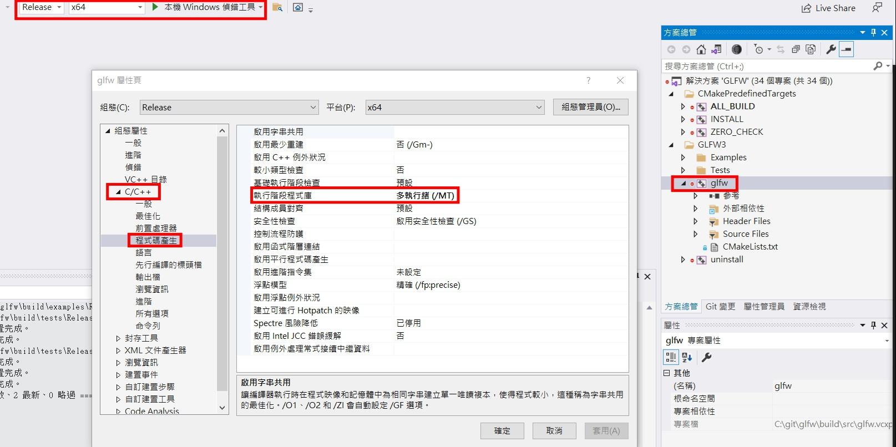
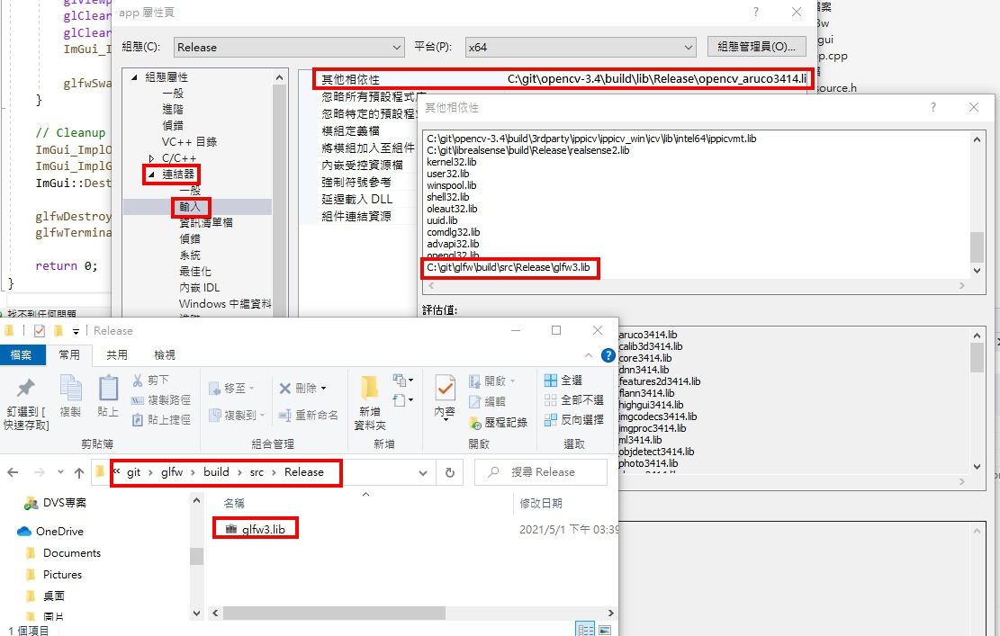

# win10 vs2019 Imgui + Opengl3

- download [imgui](https://github.com/ocornut/imgui/releases/tag/v1.82) and put at `C:\git\imgui-1.82`

- platform `Release/x64`

- set `C/C++\general\include`( copy from example_glfw_opengl3 example )



- set `link\input\` (  copy from example_glfw_opengl3 example )



- copy code from imgui to your project


- if `glfw3.lib` symbol cannot be resovled

    

    - download glfw source from github and build

    ```
    git clone https://github.com/glfw/glfw.git
    cd glfw
    mkdir build
    cd build
    cmake-gui ..
    ```
    - open vs2019 project and set glfw config

    

    - press `ctrl+shift+b` to run

    - set new `glfw3.lib` in origion project

    

## sample code copy from example_glfw_opengl3
```
// Dear ImGui: standalone example application for GLFW + OpenGL 3, using programmable pipeline
// (GLFW is a cross-platform general purpose library for handling windows, inputs, OpenGL/Vulkan/Metal graphics context creation, etc.)
// If you are new to Dear ImGui, read documentation from the docs/ folder + read the top of imgui.cpp.
// Read online: https://github.com/ocornut/imgui/tree/master/docs

#include "imgui.h"
#include "imgui_impl_glfw.h"
#include "imgui_impl_opengl3.h"
#include <stdio.h>

// About Desktop OpenGL function loaders:
//  Modern desktop OpenGL doesn't have a standard portable header file to load OpenGL function pointers.
//  Helper libraries are often used for this purpose! Here we are supporting a few common ones (gl3w, glew, glad).
//  You may use another loader/header of your choice (glext, glLoadGen, etc.), or chose to manually implement your own.
#if defined(IMGUI_IMPL_OPENGL_LOADER_GL3W)
#include <GL/gl3w.h>            // Initialize with gl3wInit()
#elif defined(IMGUI_IMPL_OPENGL_LOADER_GLEW)
#include <GL/glew.h>            // Initialize with glewInit()
#elif defined(IMGUI_IMPL_OPENGL_LOADER_GLAD)
#include <glad/glad.h>          // Initialize with gladLoadGL()
#elif defined(IMGUI_IMPL_OPENGL_LOADER_GLAD2)
#include <glad/gl.h>            // Initialize with gladLoadGL(...) or gladLoaderLoadGL()
#elif defined(IMGUI_IMPL_OPENGL_LOADER_GLBINDING2)
#define GLFW_INCLUDE_NONE       // GLFW including OpenGL headers causes ambiguity or multiple definition errors.
#include <glbinding/Binding.h>  // Initialize with glbinding::Binding::initialize()
#include <glbinding/gl/gl.h>
using namespace gl;
#elif defined(IMGUI_IMPL_OPENGL_LOADER_GLBINDING3)
#define GLFW_INCLUDE_NONE       // GLFW including OpenGL headers causes ambiguity or multiple definition errors.
#include <glbinding/glbinding.h>// Initialize with glbinding::initialize()
#include <glbinding/gl/gl.h>
using namespace gl;
#else
#include IMGUI_IMPL_OPENGL_LOADER_CUSTOM
#endif

// Include glfw3.h after our OpenGL definitions
#include <GLFW/glfw3.h>

// [Win32] Our example includes a copy of glfw3.lib pre-compiled with VS2010 to maximize ease of testing and compatibility with old VS compilers.
// To link with VS2010-era libraries, VS2015+ requires linking with legacy_stdio_definitions.lib, which we do using this pragma.
// Your own project should not be affected, as you are likely to link with a newer binary of GLFW that is adequate for your version of Visual Studio.
#if defined(_MSC_VER) && (_MSC_VER >= 1900) && !defined(IMGUI_DISABLE_WIN32_FUNCTIONS)
#pragma comment(lib, "legacy_stdio_definitions")
#endif

static void glfw_error_callback(int error, const char* description)
{
    fprintf(stderr, "Glfw Error %d: %s\n", error, description);
}

int main(int, char**)
{
    // Setup window
    glfwSetErrorCallback(glfw_error_callback);
    if (!glfwInit())
        return 1;

    // Decide GL+GLSL versions
#ifdef __APPLE__
    // GL 3.2 + GLSL 150
    const char* glsl_version = "#version 150";
    glfwWindowHint(GLFW_CONTEXT_VERSION_MAJOR, 3);
    glfwWindowHint(GLFW_CONTEXT_VERSION_MINOR, 2);
    glfwWindowHint(GLFW_OPENGL_PROFILE, GLFW_OPENGL_CORE_PROFILE);  // 3.2+ only
    glfwWindowHint(GLFW_OPENGL_FORWARD_COMPAT, GL_TRUE);            // Required on Mac
#else
    // GL 3.0 + GLSL 130
    const char* glsl_version = "#version 130";
    glfwWindowHint(GLFW_CONTEXT_VERSION_MAJOR, 3);
    glfwWindowHint(GLFW_CONTEXT_VERSION_MINOR, 0);
    //glfwWindowHint(GLFW_OPENGL_PROFILE, GLFW_OPENGL_CORE_PROFILE);  // 3.2+ only
    //glfwWindowHint(GLFW_OPENGL_FORWARD_COMPAT, GL_TRUE);            // 3.0+ only
#endif

    // Create window with graphics context
    GLFWwindow* window = glfwCreateWindow(1280, 720, "Dear ImGui GLFW+OpenGL3 example", NULL, NULL);
    if (window == NULL)
        return 1;
    glfwMakeContextCurrent(window);
    glfwSwapInterval(1); // Enable vsync

    // Initialize OpenGL loader
#if defined(IMGUI_IMPL_OPENGL_LOADER_GL3W)
    bool err = gl3wInit() != 0;
#elif defined(IMGUI_IMPL_OPENGL_LOADER_GLEW)
    bool err = glewInit() != GLEW_OK;
#elif defined(IMGUI_IMPL_OPENGL_LOADER_GLAD)
    bool err = gladLoadGL() == 0;
#elif defined(IMGUI_IMPL_OPENGL_LOADER_GLAD2)
    bool err = gladLoadGL(glfwGetProcAddress) == 0; // glad2 recommend using the windowing library loader instead of the (optionally) bundled one.
#elif defined(IMGUI_IMPL_OPENGL_LOADER_GLBINDING2)
    bool err = false;
    glbinding::Binding::initialize();
#elif defined(IMGUI_IMPL_OPENGL_LOADER_GLBINDING3)
    bool err = false;
    glbinding::initialize([](const char* name) { return (glbinding::ProcAddress)glfwGetProcAddress(name); });
#else
    bool err = false; // If you use IMGUI_IMPL_OPENGL_LOADER_CUSTOM, your loader is likely to requires some form of initialization.
#endif
    if (err)
    {
        fprintf(stderr, "Failed to initialize OpenGL loader!\n");
        return 1;
    }

    // Setup Dear ImGui context
    IMGUI_CHECKVERSION();
    ImGui::CreateContext();
    ImGuiIO& io = ImGui::GetIO(); (void)io;
    //io.ConfigFlags |= ImGuiConfigFlags_NavEnableKeyboard;     // Enable Keyboard Controls
    //io.ConfigFlags |= ImGuiConfigFlags_NavEnableGamepad;      // Enable Gamepad Controls

    // Setup Dear ImGui style
    ImGui::StyleColorsDark();
    //ImGui::StyleColorsClassic();

    // Setup Platform/Renderer backends
    ImGui_ImplGlfw_InitForOpenGL(window, true);
    ImGui_ImplOpenGL3_Init(glsl_version);

    // Load Fonts
    // - If no fonts are loaded, dear imgui will use the default font. You can also load multiple fonts and use ImGui::PushFont()/PopFont() to select them.
    // - AddFontFromFileTTF() will return the ImFont* so you can store it if you need to select the font among multiple.
    // - If the file cannot be loaded, the function will return NULL. Please handle those errors in your application (e.g. use an assertion, or display an error and quit).
    // - The fonts will be rasterized at a given size (w/ oversampling) and stored into a texture when calling ImFontAtlas::Build()/GetTexDataAsXXXX(), which ImGui_ImplXXXX_NewFrame below will call.
    // - Read 'docs/FONTS.md' for more instructions and details.
    // - Remember that in C/C++ if you want to include a backslash \ in a string literal you need to write a double backslash \\ !
    //io.Fonts->AddFontDefault();
    //io.Fonts->AddFontFromFileTTF("../../misc/fonts/Roboto-Medium.ttf", 16.0f);
    //io.Fonts->AddFontFromFileTTF("../../misc/fonts/Cousine-Regular.ttf", 15.0f);
    //io.Fonts->AddFontFromFileTTF("../../misc/fonts/DroidSans.ttf", 16.0f);
    //io.Fonts->AddFontFromFileTTF("../../misc/fonts/ProggyTiny.ttf", 10.0f);
    //ImFont* font = io.Fonts->AddFontFromFileTTF("c:\\Windows\\Fonts\\ArialUni.ttf", 18.0f, NULL, io.Fonts->GetGlyphRangesJapanese());
    //IM_ASSERT(font != NULL);

    // Our state
    bool show_demo_window = true;
    bool show_another_window = false;
    ImVec4 clear_color = ImVec4(0.45f, 0.55f, 0.60f, 1.00f);

    // Main loop
    while (!glfwWindowShouldClose(window))
    {
        // Poll and handle events (inputs, window resize, etc.)
        // You can read the io.WantCaptureMouse, io.WantCaptureKeyboard flags to tell if dear imgui wants to use your inputs.
        // - When io.WantCaptureMouse is true, do not dispatch mouse input data to your main application.
        // - When io.WantCaptureKeyboard is true, do not dispatch keyboard input data to your main application.
        // Generally you may always pass all inputs to dear imgui, and hide them from your application based on those two flags.
        glfwPollEvents();

        // Start the Dear ImGui frame
        ImGui_ImplOpenGL3_NewFrame();
        ImGui_ImplGlfw_NewFrame();
        ImGui::NewFrame();

        // 1. Show the big demo window (Most of the sample code is in ImGui::ShowDemoWindow()! You can browse its code to learn more about Dear ImGui!).
        //if (show_demo_window)
            //ImGui::ShowDemoWindow(&show_demo_window);

        // 2. Show a simple window that we create ourselves. We use a Begin/End pair to created a named window.
        {
            static float f = 0.0f;
            static int counter = 0;

            ImGui::Begin("Hello, world!");                          // Create a window called "Hello, world!" and append into it.

            ImGui::Text("This is some useful text.");               // Display some text (you can use a format strings too)
            ImGui::Checkbox("Demo Window", &show_demo_window);      // Edit bools storing our window open/close state
            ImGui::Checkbox("Another Window", &show_another_window);

            ImGui::SliderFloat("float", &f, 0.0f, 1.0f);            // Edit 1 float using a slider from 0.0f to 1.0f
            ImGui::ColorEdit3("clear color", (float*)&clear_color); // Edit 3 floats representing a color

            if (ImGui::Button("Button"))                            // Buttons return true when clicked (most widgets return true when edited/activated)
                counter++;
            ImGui::SameLine();
            ImGui::Text("counter = %d", counter);

            ImGui::Text("Application average %.3f ms/frame (%.1f FPS)", 1000.0f / ImGui::GetIO().Framerate, ImGui::GetIO().Framerate);
            ImGui::End();
        }

        // 3. Show another simple window.
        if (show_another_window)
        {
            ImGui::Begin("Another Window", &show_another_window);   // Pass a pointer to our bool variable (the window will have a closing button that will clear the bool when clicked)
            ImGui::Text("Hello from another window!");
            if (ImGui::Button("Close Me"))
                show_another_window = false;
            ImGui::End();
        }

        // Rendering
        ImGui::Render();
        int display_w, display_h;
        glfwGetFramebufferSize(window, &display_w, &display_h);
        glViewport(0, 0, display_w, display_h);
        glClearColor(clear_color.x * clear_color.w, clear_color.y * clear_color.w, clear_color.z * clear_color.w, clear_color.w);
        glClear(GL_COLOR_BUFFER_BIT);
        ImGui_ImplOpenGL3_RenderDrawData(ImGui::GetDrawData());

        glfwSwapBuffers(window);
    }

    // Cleanup
    ImGui_ImplOpenGL3_Shutdown();
    ImGui_ImplGlfw_Shutdown();
    ImGui::DestroyContext();

    glfwDestroyWindow(window);
    glfwTerminate();

    return 0;
}
```


