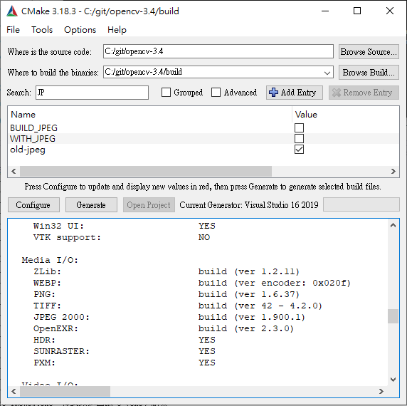

# Ubuntu realsense server + windows client)

## Devices Requirements

- N Ubuntu PCs (run rs-server) + N realsenses
- 1 router (use LAN with DHCP)
- 1 Windows PC (run app)

# Linux realsense server

- [install realsense SDK](https://github.com/IntelRealSense/librealsense/blob/master/doc/distribution_linux.md) ( [local version](./doc/distribution_linux.md) )

- Auto login

    1. Detail/user/
    2. unlock button, type password
    3. toggle auto login ON

- [Set screen blanking time](https://help.ubuntu.com/stable/ubuntu-help/display-blank.html.en)
    1. Open the Activities overview and start typing Power.

    2. Click `Power` to open the panel.

    3. Use the Blank screen drop-down list under Power Saving to set the time until the screen blanks, or disable the blanking completely.
- [The screen locks itself too quickly
](https://help.ubuntu.com/stable/ubuntu-help/session-screenlocks.html.en)

    1. Open the Activities overview and start typing Privacy.

    2. Click on `Privacy` to open the panel.

    3. Press on `Screen Lock`.

    4. If Automatic Screen Lock is on, you can change the value in the Lock screen after blank for drop-down list.

- run command `rs-server`

# Windows Client

- requirements

    - vs2019 + Window SDK
    - [cmake 3.18.3](https://github.com/Kitware/CMake/releases?after=v3.19.0-rc2)

- build realsenseSDK with opencv, network-device

- [build with opencv](https://github.com/IntelRealSense/librealsense/blob/master/wrappers/opencv/readme.md)( [local version](./doc/realsense-opencv.md) ), Uncheck `BUILD_SHARED_LIBS`, check `old-jpeg` 
    - if you need `NETWORK_DEVICE` in realsense, because realsense cmake have `libjpeg-turbo` too.



- if you need aruco build with [opencv_contrib](https://github.com/opencv/opencv_contrib/tree/3.4) and include `.hpp`


- build with network-device  :

```
# Building from Source
git clone https://github.com/IntelRealSense/librealsense.git

cd librealsense/
mkdir build
cd build

cmake-gui  ..
```

- Press Configure and Make sure you check the `BUILD_CV_EXAMPLES` and `BUILD_NETWORK_DEVICE` flag and click Configure again


- Specify CMake binaries folder for OpenCV as `OpenCV_DIR` (c:/git/opencv-3.4/build)


- set opencv dll to realsense directory


## Run viewer

- get device ip address by `ifconfig` or `hostname -I` in ubuntu.


## Run Example (network in necessary for checking packages)

- finde examples at `C:\git\librealsense\build\examples\RealsenseExamples.sln`

- add `realsense2-net` to `CMakeLists.txt`-`target_link_libraries`
    
    

- Use our `./rs-imshow.cpp` code to test network device or build one your self :

    - include `<librealsense2-net/rs_net.hpp>`

    - build network pipe
        ```
        rs2::net_device dev("192.168.0.106");
        rs2::context ctx;
        dev.add_to(ctx);
        rs2::pipeline pipe(ctx);

        rs2::config cfg;
        cfg.enable_stream(RS2_STREAM_DEPTH,640,480,RS2_FORMAT_Z16,30);
        cfg.enable_stream(RS2_STREAM_COLOR,1280,720, RS2_FORMAT_BGR8, 30);
        ```
        

    - run and click `reload project`.

# Setup my own vs2019 project with OpenCV + Realsesne

- assume librealsense and opencv already build at `C:\git\librealsense\build` and `C:\git\opencv-3.4\build`

- platform `Release/x64`

- set `C/C++\general\include`( copy from rs-imshow example )

```
C:\git\librealsense\build;C:\git\librealsense\include;C:\git\opencv-3.4\build;C:\git\opencv-3.4\include;C:\git\opencv-3.4\include\opencv;C:\git\opencv-3.4\modules\core\include;C:\git\opencv-3.4\modules\flann\include;C:\git\opencv-3.4\modules\imgproc\include;C:\git\opencv-3.4\modules\ml\include;C:\git\opencv-3.4\modules\photo\include;C:\git\opencv-3.4\modules\video\include;C:\git\opencv-3.4\modules\dnn\include;C:\git\opencv-3.4\modules\features2d\include;C:\git\opencv-3.4\modules\imgcodecs\include;C:\git\opencv-3.4\modules\shape\include;C:\git\opencv-3.4\modules\videoio\include;C:\git\opencv-3.4\modules\calib3d\include;C:\git\opencv-3.4\modules\highgui\include;C:\git\opencv-3.4\modules\objdetect\include;C:\git\opencv-3.4\modules\stitching\include;C:\git\opencv-3.4\modules\superres\include;C:\git\opencv-3.4\modules\ts\include;C:\git\opencv-3.4\modules\videostab\include;%(AdditionalIncludeDirectories)
```


- set `C/C++\code gen` to `多執行緒 (/MT)`


- set `link\input\` ( copy from rs-imshow example and modify some relative path )
```
C:\git\opencv-3.4\build\lib\Release\opencv_calib3d3414.lib
C:\git\opencv-3.4\build\lib\Release\opencv_core3414.lib
C:\git\opencv-3.4\build\lib\Release\opencv_dnn3414.lib
C:\git\opencv-3.4\build\lib\Release\opencv_features2d3414.lib
C:\git\opencv-3.4\build\lib\Release\opencv_flann3414.lib
C:\git\opencv-3.4\build\lib\Release\opencv_highgui3414.lib
C:\git\opencv-3.4\build\lib\Release\opencv_imgcodecs3414.lib
C:\git\opencv-3.4\build\lib\Release\opencv_imgproc3414.lib
C:\git\opencv-3.4\build\lib\Release\opencv_ml3414.lib
C:\git\opencv-3.4\build\lib\Release\opencv_objdetect3414.lib
C:\git\opencv-3.4\build\lib\Release\opencv_photo3414.lib
C:\git\opencv-3.4\build\lib\Release\opencv_shape3414.lib
C:\git\opencv-3.4\build\lib\Release\opencv_stitching3414.lib
C:\git\opencv-3.4\build\lib\Release\opencv_superres3414.lib
C:\git\opencv-3.4\build\lib\Release\opencv_video3414.lib
C:\git\opencv-3.4\build\lib\Release\opencv_videoio3414.lib
C:\git\opencv-3.4\build\lib\Release\opencv_videostab3414.lib
C:\git\librealsense\build\src\ethernet\Release\realsense2-net.lib
C:\git\opencv-3.4\build\3rdparty\lib\Release\libprotobuf.lib
comctl32.lib
gdi32.lib
ole32.lib
setupapi.lib
ws2_32.lib
C:\git\opencv-3.4\build\3rdparty\lib\Release\quirc.lib
C:\git\opencv-3.4\build\3rdparty\lib\Release\libwebp.lib
C:\git\opencv-3.4\build\3rdparty\lib\Release\libpng.lib
C:\git\opencv-3.4\build\3rdparty\lib\Release\libtiff.lib
C:\git\opencv-3.4\build\3rdparty\lib\Release\libjasper.lib
C:\git\opencv-3.4\build\3rdparty\lib\Release\IlmImf.lib
C:\git\opencv-3.4\build\3rdparty\lib\Release\zlib.lib
C:\git\opencv-3.4\build\3rdparty\lib\Release\ittnotify.lib
C:\git\opencv-3.4\build\3rdparty\lib\Release\ippiw.lib
C:\git\opencv-3.4\build\3rdparty\ippicv\ippicv_win\icv\lib\intel64\ippicvmt.lib
C:\git\librealsense\build\Release\realsense2.lib
kernel32.lib
user32.lib
winspool.lib
shell32.lib
oleaut32.lib
uuid.lib
comdlg32.lib
advapi32.lib
```


- copy `realsense.dll` and `realsense-net.dll` from `C:\git\librealsense\build\Release` to your project `x64` folder.